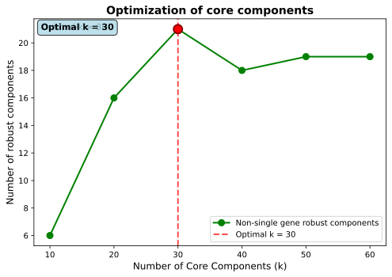
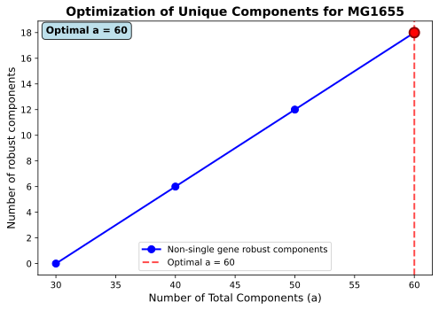
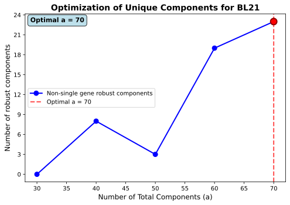
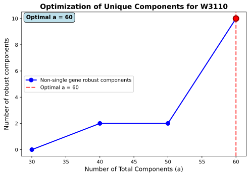

MultiModulon Worflow
====================

This notebook demonstrates the first step for multi-species/strain/modality analysis using the MultiModulon package.

Step 1: Initialize MultiModulon
-------------------------------

Load data from the Input_Data directory containing expression matrices, gene annotations, and sample metadata for all strains.

.. code-block:: python

   # Import required libraries
   from multimodulon import MultiModulon
   import pandas as pd
   import numpy as np
   import matplotlib.pyplot as plt

   # Set display options
   pd.set_option('display.max_columns', None)
   pd.set_option('display.max_rows', 50)

   # Path to the Input_Data folder
   input_data_path = './Input_Data'

   # Initialize MultiModulon object
   multiModulon = MultiModulon(input_data_path)

Step 2: Create Gene Tables
--------------------------

Parse GFF files to create gene annotation tables for each strain.

.. code-block:: python

   # Create gene tables from GFF files
   print("Creating gene tables from GFF files...")
   multiModulon.create_gene_table()

   multiModulon.add_eggnog_annotation("./Output_eggnog_mapper")

Step 3: Generate BBH Files
--------------------------

Generate Bidirectional Best Hits (BBH) files for ortholog detection between all strain pairs.

.. code-block:: python

   # Generate BBH files using multiple threads for faster computation
   output_bbh_path = './Output_BBH'

   multiModulon.generate_BBH(output_bbh_path, threads=16)

Step 4: Align Genes Across Strains
----------------------------------

Create a unified gene database by aligning genes across all strains using the BBH results.

.. code-block:: python

   # Align genes across all strains
   output_gene_info_path = './Output_Gene_Info'

   combined_gene_db = multiModulon.align_genes(
       input_bbh_dir=output_bbh_path,
       output_dir=output_gene_info_path,
       reference_order=['MG1655', 'BL21', 'W3110'],  # optional: specify order
       # bbh_threshold=90  # optional: minimum percent identity threshold
   )

   combined_gene_db.head()

Step 5: Generate Aligned Expression Matrices
--------------------------------------------

Create expression matrices with consistent gene indexing across all strains for multi-view ICA.

.. code-block:: python

   # Generate aligned expression matrices
   print("Generating aligned expression matrices...")
   multiModulon.generate_X(output_gene_info_path)

   # The output shows aligned X matrices and dimension recommendations

Step 6: Optimize Number of Core Components
------------------------------------------

Determine the optimal number of core components.

.. code-block:: python

   # Optimize number of core components
   print("Optimizing number of core components...")
   print("This will test different values of k and find the optimal number.")

   optimal_num_core_components = multiModulon.optimize_number_of_core_components(
       step=10,                        # Test k = 5, 10, 15, 20, ...
       save_path='./Output_Optimization_Figures',  # Save plots to directory
       fig_size=(7, 5),                # Figure size
       num_runs_per_dimension=10,
       seed=10
   )

   Core component optimization result.

Step 7: Optimize Number of Unique Components
--------------------------------------------

Determine the optimal number of unique (species-specific) components for each strain.

.. code-block:: python

   # Optimize unique components for each species
   print("Optimizing unique components per species...")
   print("This will test different numbers of unique components for each species.\n")

   optimal_unique, optimal_total = multiModulon.optimize_number_of_unique_components(
       optimal_num_core_components=optimal_num_core_components,
       step=10,
       save_path='./Output_Optimization_Figures',
       fig_size=(7, 5),
       num_runs_per_dimension=10,
       seed=10
   )

   Unique component optimization result for MG1655.

   Unique component optimization result for BL21.

   Unique component optimization result for W3110.

.. code-block:: python

   optimal_num_core_components

   optimal_total

Step 8: Run Robust Multi-view ICA
---------------------------------

Perform robust multi-view ICA with multiple runs and clustering to identify consistent components.

.. code-block:: python

   # Run robust multi-view ICA
   print("Running robust multi-view ICA with clustering...")
   print("This performs multiple ICA runs and clusters the results for robustness.\n")

   M_matrices, A_matrices = multiModulon.run_robust_multiview_ica(
       a=optimal_total,                 # Dictionary of total components per species
       c=optimal_num_core_components,   # Number of core components
       num_runs=10,                     # Number of runs for robustness
       seed=100                         # Random seed for reproducibility
   )

Step 9: Optimize thresholds to binarize the M matrices
------------------------------------------------------

Use Otsu's method to calculate thresholds for each component in M matrices across all species.

.. code-block:: python

   multiModulon.optimize_M_thresholds(method="Otsu's method", quantile_threshold=95)

Step 10: Save the multiModulon object to json
---------------------------------------------

Save the multiModulon object to json in the given path and file name.

.. code-block:: python

   multiModulon.save_to_json_multimodulon("./multiModulon_E_coli_comparison_demo.json.gz")

   for i in multiModulon.species:
       print(i, " : ", multiModulon[i].M.shape)
